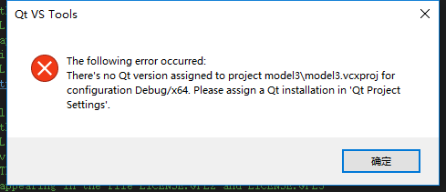
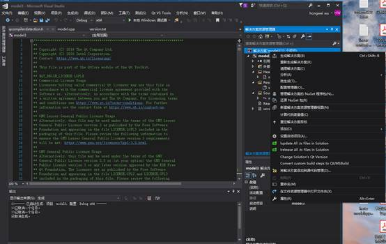
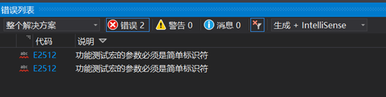
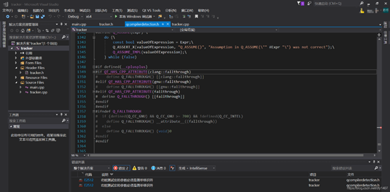

# **PFC6.0用户自定义环境配置**以及常见错误

## 环境配置

1、安装对应版本的Qt 和vs 。此过程可以按照手册中来http://docs.itascacg.com/pfc600/pfc/docproject/source/manual/optional_features/plugins/plugins.html?node2371 。注：Qt无需安装至手册中指定目录。

2、全都配置完成之后打开vs 2017，在新建项目中的visual C++下找到model的模板，命名后新建。（如果做function就选function）。

3、新建完成之后，右键项目选择属性页：

（1）修改C/C++选项卡下附加包含目录中的路径到对应PFC6.0的安装位置interface文件夹路径下，如D:\PFC6.00.24\pluginfiles\interface;

（2）修改链接器中附加库目录到对应PFC6.0的安装位置pluginfiles\lib\exe64文件夹下如D:\PFC6.00.24\pluginfiles\lib\exe64;

4、更改完路径后，进行debug操作，若能成功生成即已经成功编译。

注1：如果进行debug属性页的更改就选择debug，如果更改了debug的属性页进行release就会报错。

注2：若弹出dll不是有效的win32应用程序无法运行的错误是正常的，因为动态链接库本身就不能单独运行。

5、将dll放入指定路径或使用 [program` `load` `contactmodelmechanical](http://docs.itascacg.com/pfc600/common/kernel/doc/manual/program/commands/cmd_program.load.html#kwd:program.load.contactmodelmechanical) 命令。

 

## 常见的错误

 

### 1、若报错如图：

解决：右键解决方案，选择change solution’s qt version

 

 

 

 

### 2、若报此错误:

 

找到划红色下划线的代码部分

将上面原有的代码改为：

\#if defined(__cplusplus)

\#if defined(__clang__)

\#if QT_HAS_CPP_ATTRIBUTE(clang::fallthrough)

\#  define Q_FALLTHROUGH() [[clang::fallthrough]]

\#endif

\#elif defined(__GNUC__)

\#if QT_HAS_CPP_ATTRIBUTE(gnu::fallthrough)

\#  define Q_FALLTHROUGH() [[gnu::fallthrough]]

\#endif

\#elif QT_HAS_CPP_ATTRIBUTE(fallthrough)

\# define Q_FALLTHROUGH() [[fallthrough]]

\#endif

\#endif

 

### 3、warning C4273: dll 链接不一致

这是因为rrHertz_LIB 没有预定义

解决办法：项目属性-> C/C++ -> 预处理器 ->预处理器定义，添加rrHertz_LIB即可

 

#### 4、遇到修改代码后重新编译的dll与之前相同，并没有发生明显变化，除了代码没修改对的原因外还可能是工程本身的问题。PFC的dll加载并不是实时（也可能是盗版的原因），存在一定问题。

解决方法：重新新建工程，复制一遍修改后的代码。

 

#### 5、出现XXXX background build failed.

解决方法：不在vs里打开文件而从文件夹里打开工程文件。

2020.9.20